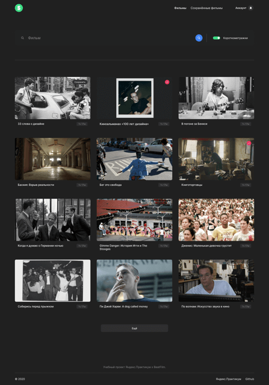

# Movies App  

- Frontend: https://movies-vg.nomoredomains.icu  
- Backend: https://api.movies-vg.nomoredomains.icu  
- Репозиторий на `GitHub` https://github.com/vgaidukov/diploma-backend
- Макет `.fig` https://disk.yandex.ru/d/V5UQ0Jaxn1onxg  

## Одностраничное приложение на `React`
Позволяет пользователям найти интересные для него фильмы и сохранить к себе в избранное.  
Также содержит персональную информацию об авторе и ссылки на портфолио.  

#### Пользователю доступны:
+ регистрация
+ авторизация
+ редактирование профиля
+ поиск фильмов
+ фильтр по длительности

## Запуск проекта

`npm run start` — запускает приложение в режиме разработки   
`npm run build` — запускает сборку проекта в папку build  
`npm run lint` — запускает линтер

#### Реализован следующий функционал:
- Авторизация пользователя, хранение токена, защита роутов авторизацией.
- Запросы к бэкенду с использованием промисов. В момент выполнения запросов отображается прелоадер. Все промисы завершаются Catch. При ошибках пользователю показываются сообщения.
- Моментальная валидация полей в формах. Сабмит формы не возможен до тех пор, пока форма не валидна. Для валидации применен кастомный хук.
- Фильтр по хронометражу фильмов.
- Отображение страницы 404 при попытке зайти на несуществующую страницу.
- Кнопка "Еще" с подгрузкой списка фильмов. Количество подгружаемых и начальных фильмов на странице зависит от разрешения экрана.

#### CSS
При именовании классов элементов страницы применена методология `БЭМ`.  
Для построения каркаса приложения используется `flexbox`, для построения сетки карточек с фильмамим - `grid`.  
Реализована адаптивная верстка.
____
#### Стэк
`HTML` `CSS` `React` `JSX`

#### Бэкенд
`Node.js` `Express.js` `mongoose` `MongoDB`  

## Preview :

